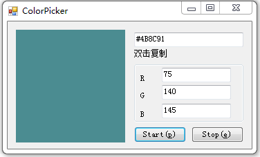

ColorPicker
===========

######A tool to pick web/window color, help design your soft.

===

2017-03-04

已知bug：

取多屏颜色时程序错误。

懒得改了，目前只要将需要取色的地方移到主屏就行了。

===

更新时间:2016-03-10

增加:
1.R，G，B色值显示

===

更新时间:2014-07-01

修正:
1.某些颜色和某些青色取色失败；

(原因：取色数值首位为0忽略了，例如#04A85F墨绿色，取色器丢掉了首位0)

===

创建时间:2014-02-27

更新时间:2014-04-14

增加:

1.取色快捷键;

2.双击复制代码;

已知bug:

1.某些蓝色和某些青色取色失败.

###License

Code in the ColorPicker project is licensed under the GPL.
