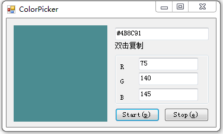

# ColorPicker

[English](README.en.md) | 简体中文

一个轻量、直接、为 Windows 桌面设计的屏幕取色器。

## Highlights

- 实时读取鼠标所在像素颜色
- 显示 HEX、R、G、B 色值
- 双击即可复制 HEX 或单独的 RGB 通道值
- 支持停止取色后手动输入 RGB 调色
- 修复旧版本多显示器取色异常
- 使用 Win32 单像素读取，避免高频整屏截图
- 面向 .NET Framework 4.8，覆盖 Windows 7 SP1 到 Windows 11 的兼容路线
- 启用基础高 DPI 配置，适配现代高分屏环境

## Quick Start

打开程序后点击 `Start(P)` 开始取色，移动鼠标即可实时更新当前像素颜色。

点击 `Stop(E)` 后可以手动编辑 R、G、B 数值，预览区域会同步显示对应颜色。

可复制内容：

- 双击 HEX 输入框复制完整颜色值，例如 `#04A85F`
- 双击 R / G / B 输入框复制单个通道值

## Compatibility

推荐运行环境：

- Windows 7 SP1
- Windows 10
- Windows 11

运行依赖：

- .NET Framework 4.8 或更高的 .NET Framework 4.x 就地更新版本

说明：

- Windows 10 新版本通常自带 .NET Framework 4.8。
- Windows 11 通常自带 .NET Framework 4.8 或 4.8.1。
- Windows 7 SP1 需要手动安装 .NET Framework 4.8。

## Build

项目仍保留传统 WinForms 工程结构，适合用 Visual Studio 或 Build Tools 编译。

建议环境：

- Visual Studio 2019 / 2022
- .NET Framework 4.8 Developer Pack
- MSBuild

构建配置：

- Target framework: `.NET Framework 4.8`
- Platform target: `x86`
- Output type: `WinExe`

## Modernization Notes

本仓库已完成第一轮兼容性改造：

- 从 `.NET Framework 4.0 Client Profile` 升级到 `.NET Framework 4.8`
- 删除 Client Profile
- 新增 `App.config` 高 DPI 配置
- 新增 `app.manifest` 系统兼容声明
- 修复多屏取色坐标问题
- 删除高频 `GC.Collect()`
- 修复 RGB 非法输入导致的崩溃

后续计划与验证矩阵见：

[docs/HARNESS.md](docs/HARNESS.md)

## Release Notes

每次发布和维护改造都会记录在：

[docs/CHANGELOG.md](docs/CHANGELOG.md)

## Project History

原项目创建于 2014 年，后续增加了快捷键、双击复制、RGB 显示和手动 RGB 调色能力。完整历史记录见 Release Notes。

本维护版本主要面向现代 Windows 使用场景，重点改善多显示器、高 DPI、性能和构建兼容性。

## License

Code in the ColorPicker project is licensed under the GPL.
